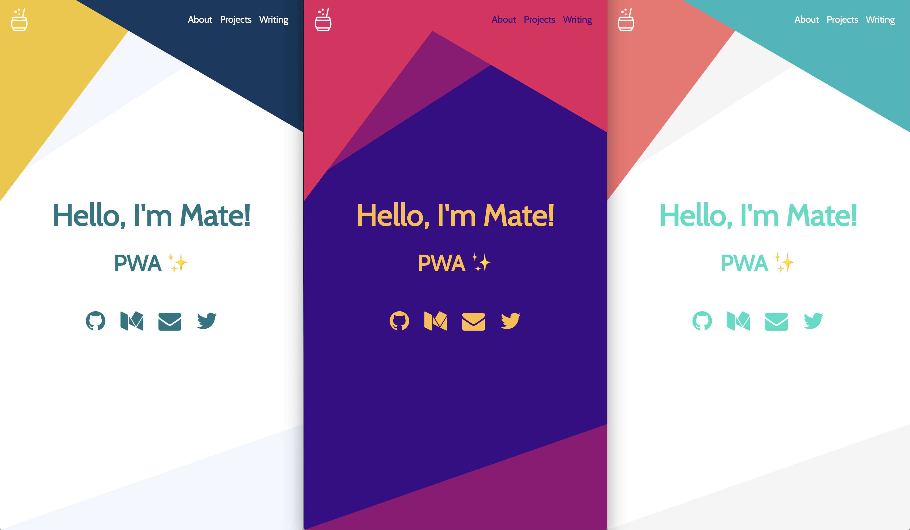

# Portfolio: Mohit Kumar

### [Visit the site ✨](https://mohit-kumar.dev)

## Features 🛠

- [Gatsby](https://www.gatsbyjs.org/)
- [Rebass](https://rebassjs.org/): styled component system
- [React Awesome Reveal](https://github.com/dennismorello/react-awesome-reveal)
- Typescript
- CMS Integration with [Contentful](https://contentful.com)
- PWA ready
- SEO
- Responsive design
- Icons from [font-awesome](https://fontawesome.com/)
- [Netlify](https://www.netlify.com) Deployment Friendly
- Medium integration
- Social sharing (Twitter, Facebook, Google, LinkedIn)
- Developer tools:
  - `eslint`
  - `prettier`
- Google Analytics integration
- End to End with Cypress:
  - A11y testing with [Axe](https://www.deque.com/axe/)
  - Visual Testing with [Percy](https://percy.io/)

## How to start ▶️

To copy and install this repo run this command:

```bash
$ git clone https://github.com/ajaykumar97/ajay-kumar && npm install
```

At this point you have the repository download with all the dependencies installed, but if you try to start by running `npm run develop` you are going to received this message in the console:

```bash
  TypeError: Expected parameter accessToken
```

# Note: Use this command only when you are making a new clone of this website or resetting all of the setup

This is because you didn't specify from which `Contentful` space the portfolio will take the information. So the next step is to go to the portfolio space in [Contentful](https://www.contentful.com/)!

After opening the Contentfull space, run the following command:

```bash
npm run setup
```

This CLI will request 3 values:

- `Space ID`
- `Content Delivery API - access token`
- `Personal Access Token`

These 3 values are inside the Settings section --> API keys.

After you provide them the CLI will automatically starts copying all the `Content models` and `Contents` from `mate-demo-contentful` to your space ✨

If everything went smooth you should see something like this in your terminal:

```text
Writing config file...
Config file /Users/my-user/Git/test/mate-portfolio/.env written
┌──────────────────────────────────────────────────┐
│ The following entities are going to be imported: │
├─────────────────────────────────┬────────────────┤
│ Content Types                   │ 3              │
├─────────────────────────────────┼────────────────┤
│ Editor Interfaces               │ 3              │
├─────────────────────────────────┼────────────────┤
│ Entries                         │ 8              │
├─────────────────────────────────┼────────────────┤
│ Assets                          │ 6              │
├─────────────────────────────────┼────────────────┤
│ Locales                         │ 1              │
├─────────────────────────────────┼────────────────┤
│ Webhooks                        │ 0              │
└─────────────────────────────────┴────────────────┘
 ✔ Validating content-file
 ✔ Initialize client (1s)
 ✔ Checking if destination space already has any content and retrieving it (2s)
 ✔ Apply transformations to source data (1s)
 ✔ Push content to destination space
   ✔ Connecting to space (1s)
   ✔ Importing Locales (1s)
   ✔ Importing Content Types (4s)
   ✔ Publishing Content Types (3s)
   ✔ Importing Editor Interfaces (3s)
   ✔ Importing Assets (7s)
   ✔ Publishing Assets (3s)
   ✔ Archiving Assets (1s)
   ✔ Importing Content Entries (1s)
   ✔ Publishing Content Entries (5s)
   ✔ Archiving Entries (1s)
   ✔ Creating Web Hooks (0s)
Finished importing all data
```

## Running the project

Make sure that you have the `.env` file(containing `SPACE_ID` and `ACCESS_TOKEN`) available at the root of your project.

Run the following script to start the project:

```bash
$ npm start
```

The webisite result will be available at http://localhost:8000/ 😃

## Screenshot and Design 🖼

As the portfolio is a SPA it only has two routes:

- `/`: main page with the sections of `Home`, `About me`, `Projects` and `Writing`.
- `/404`: error page for unexpected route.

| Section  |                            Screenshot                            |
| -------- | :--------------------------------------------------------------: |
| Home     |       |
| About me |     |
| Projects |  |
| Writing  |    |
| 404      |            |

## Theming 🎨

This portfolio has a hand-made color palette made by myself, but we can customize the colors to match our preference! The colors can be found inside [`theme.ts`](./src/theme.ts), which are going to be loaded by `ThemeProvider` of `styled-components` and apply across all the components inside the application.

```javascript
// colors.js
module.exports = {
  background: '#FFFFFF',
  backgroundDark: '#f0e6f6',

  text: '#333333',

  primary: '#7c37ad',
  primaryLight: '#ae66df',
  primaryDark: '#4b007d',

  secondary: '#ff4081',
  secondaryLight: '#ff79b0',
  secondaryDark: '#c60055',
};
```

We can also use the color palettes from [Color Hunt](https://colorhunt.co/):



## Building the site 📦

As we are dealing with environment variables, the `.env` file is excluded from `.gitignore` file. Therefore, in order to deploy the website you have to send `SPACE_ID` and `ACCESS_TOKEN` with the `build` command.

```bash
SPACE_ID=xxxxx ACCESS_TOKEN=yyyyy npm run build
```

The result will be stored inside the `public` folder, so you can upload to your web host. I highly suggest using this starter with Netlify when you can define which command will build the project and also send the environment variables inside the website configuration.

## Adding your information 📝

All the text of this portfolio live inside Contentful, specifically inside the Content of `About`. In order to change it, just go to `Content` section and change the entity of About with the information you want.


Regarding the projects and social links the process is the same! Contentful is really easy to learn so don't be afraid of breaking everything, remember that you can restore to the start point by running `npm run setup` 😄

## End to End Testing with Cypress 🧪

The portfolio comes with a built in End to End Setup using Cypress. As there are no complex logic flow, there are only two tests in place:

1. Accessibility check: using the [cypress-axe](https://www.npmjs.com/package/cypress-axe) plugin you can easily check a lot of a11y rules at once powered by [Axe](https://www.deque.com/axe/)!
2. Visual testing: using [percy-cypress](https://github.com/percy/percy-cypress) plugin you can take screenshot with different resolutions and easily the difference inside their platform.

### Setting Visual Testing for your project (Optional) 📸

By default, the visual testing will fail due to Percy needs a Token in order to know with which project of your account is related. The steps to set up your own visual testing workflow is:

- Create a project in [Percy](https://percy.io/).
- Go to "Project settings" -> "Project token" and copy the whole line saying "PERCY_TOKEN=<YOUR_TOKEN>".
- Open the `.env` file located in the root of the project and add the token to your credentials.
- Try running `npm run e2e:ci` and you should be able to see a new build inside your Project Dashboard in Percy.

## Configuration (Optional) 👷‍♂️

This portfolio is a SPA (Single Page Application), so basically we have only two pages:

- `Main.js`: portfolio itself
- `404.js`: 404 error page with the same style

The structure for the main page is the following:

```javascript
<Layout>
  <Landing />
  <About />
  <Projects />
  <Writing />
</Layout>
```

`Layout` is the core of the application, it manages the theme for the application, the navigation between sections, also it defines the `header`.

All the components inside `Layout` are `Section` components. A section can have a link inside the `Header` or not, in order to add you need to wrapped the exported `Section` with `withNavigation` HOC and it will be automatically registered (Context magic ✨).

## Tracking with Google Analytics (Optional) 📈

This portfolio has the analytics plugin inside the `gatsby-config`, so the only need to do in order to enable it is to provide the `Tracking Id` for your site (starts with `UA-`). Just set a new variable inside your `.env` file called `ANALYTICS_ID` and analytics will be turn on automatically 😄

## License 📝

MIT.
